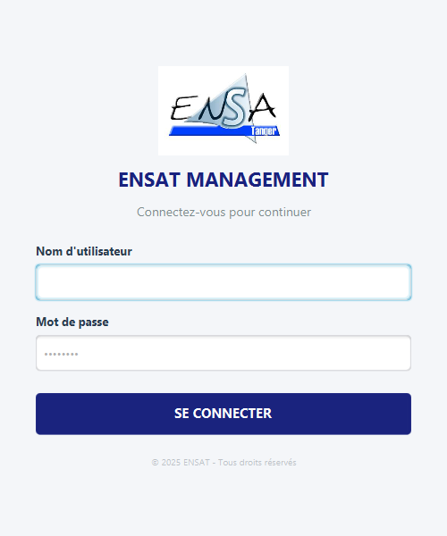
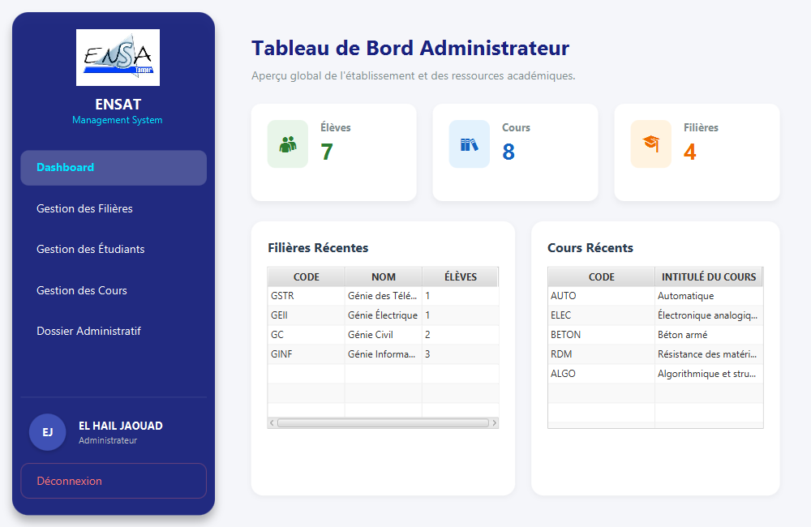
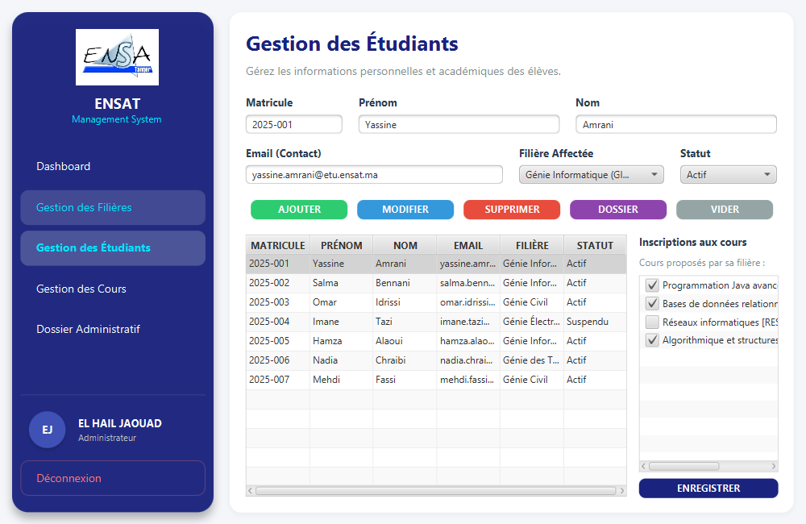
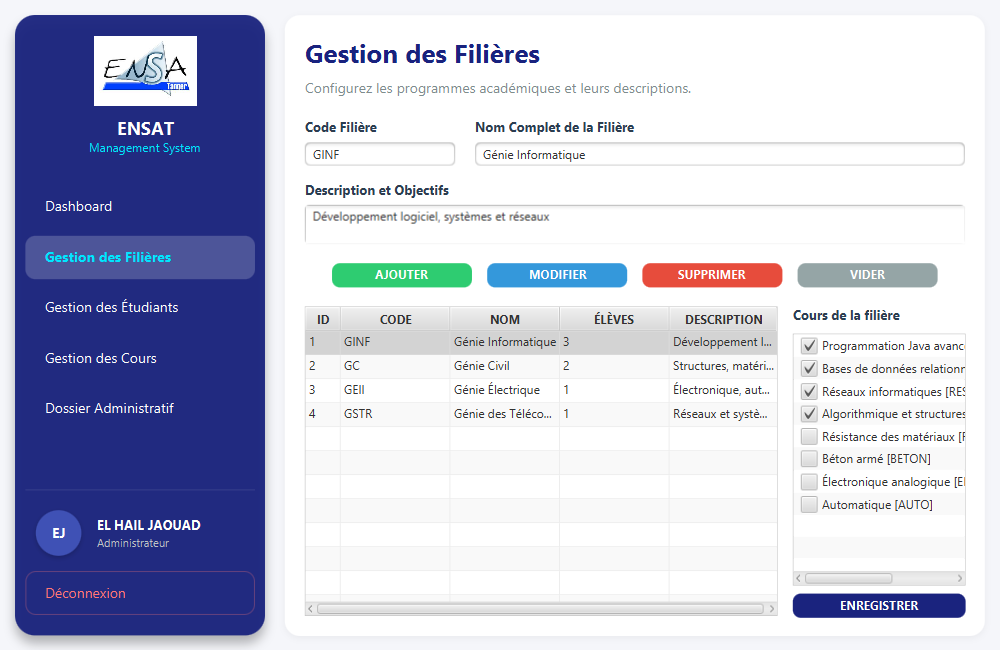
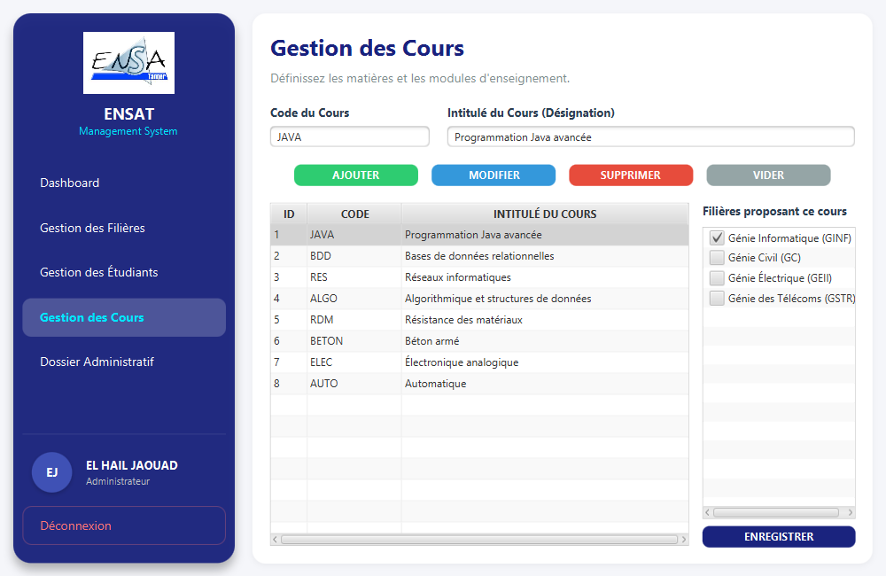
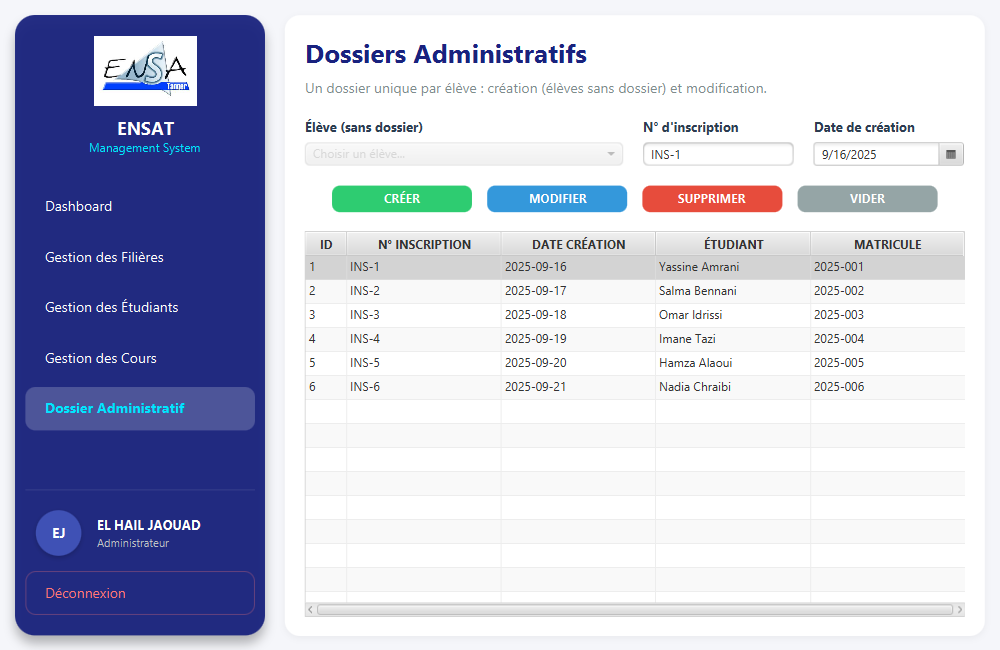
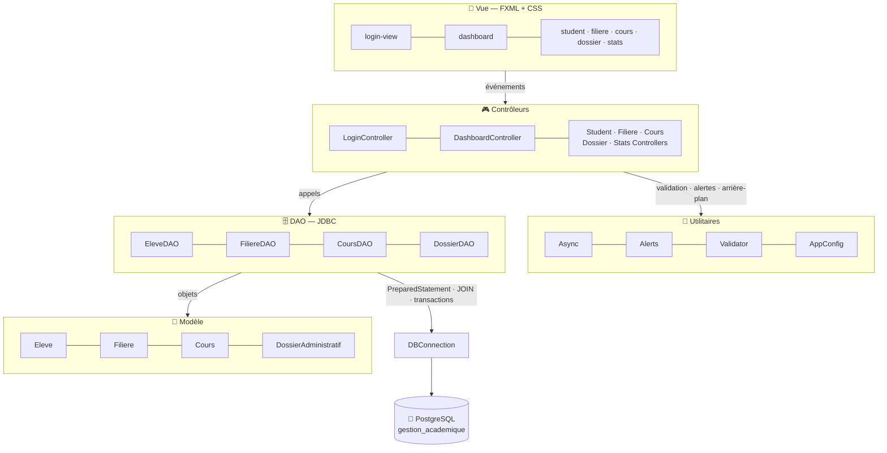
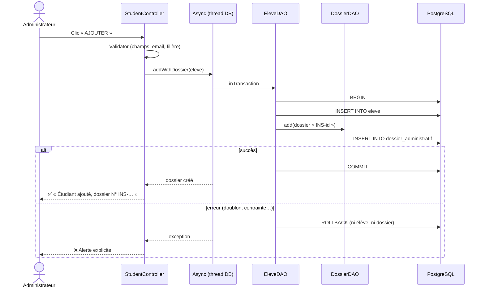
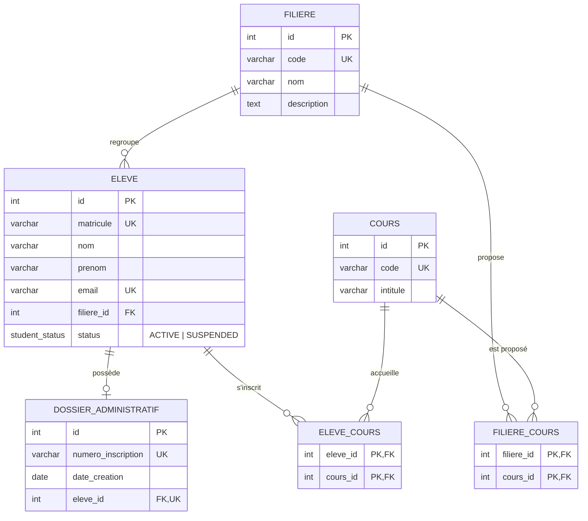

<div align="center">


# ENSAT Management

### Système de Gestion Académique — JavaFX · JDBC · PostgreSQL

Application de bureau pour gérer les **filières**, les **étudiants**, les **cours**, les **inscriptions** et les **dossiers administratifs** d'un établissement d'enseignement, avec des règles métier strictes et des transactions explicites.


</div>

---

## 📑 Sommaire

1. [Aperçu](#-aperçu)
2. [Fonctionnalités](#-fonctionnalités)
3. [Règles métier](#-règles-métier)
4. [Architecture](#-architecture)
5. [Modèle de données](#-modèle-de-données)
6. [Structure du projet](#-structure-du-projet)
7. [Installation et lancement](#-installation-et-lancement)
8. [Choix techniques](#-choix-techniques)
9. [Difficultés rencontrées](#-difficultés-rencontrées)
10. [Auteur](#-auteur)

---

## 🖼️ Aperçu

| Connexion | Tableau de bord |
|:---:|:---:|
|  |  |

| Étudiants & inscriptions | Filières & cours associés |
|:---:|:---:|
|  |  |

| Cours & affectation aux filières | Dossiers administratifs |
|:---:|:---:|
|  |  |

---

## ✨ Fonctionnalités

### 🔐 Connexion
- Authentification administrateur ; identifiants lus dans `config.properties` ou dans des variables d'environnement, **jamais écrits dans le code**.

### 📊 Tableau de bord
- Cartes statistiques : nombre total d'élèves, de cours et de filières.
- Les 5 filières et les 5 cours les plus récents, avec le **nombre d'élèves par filière**.

### 🏫 Filières
- CRUD complet avec formulaire et `TableView`.
- **Association des cours** proposés par la filière (liste à cases à cocher).
- Colonne « Élèves » ; suppression bloquée tant que la filière contient des élèves.

### 🎓 Étudiants
- CRUD complet : matricule, nom, prénom, email, filière, **statut ACTIF / SUSPENDU**.
- **Création automatique du dossier administratif**, dans la même transaction que l'élève.
- **Inscription à plusieurs cours**, limitée aux cours proposés par sa filière ; impossible pour un élève suspendu.
- Bouton **Dossier** : accès direct au dossier administratif de l'élève.

### 📚 Cours
- CRUD complet.
- **Affectation aux filières** depuis la fiche du cours.

### 🗂️ Dossiers administratifs
- **Création** pour les élèves qui n'en ont pas encore, et **modification** (N° d'inscription, date).
- Un seul dossier par élève, garanti en base et dans l'application.

### 💡 Expérience utilisateur
| | |
|---|---|
| **Validation des formulaires** | Champs obligatoires, longueurs maximales, format de l'email |
| **Alertes claires** | Erreurs SQL traduites (doublon, base inaccessible, mot de passe refusé…) |
| **Confirmations** | Avant chaque suppression, avec ses conséquences (dossier, inscriptions) |
| **Interface fluide** | Requêtes exécutées en arrière-plan : la fenêtre ne se fige jamais |
| **Navigation clavier** | La sélection d'une ligne remplit le formulaire, à la souris comme au clavier |

---

## 📏 Règles métier

| # | Règle | Garantie par |
|:-:|---|---|
| 1 | Matricule élève unique | Contrainte `UNIQUE` + alerte « valeur déjà existante » |
| 2 | Code filière / cours unique | Contraintes `UNIQUE` |
| 3 | Un élève ne suit que des cours proposés par sa filière | Vérification dans la transaction d'inscription ; nettoyage automatique des inscriptions invalides (changement de filière, cours retiré d'une filière) |
| 4 | Un dossier administratif unique par élève | `UNIQUE (eleve_id)` + contrôle dans `DossierDAO` |
| 5 | Suppression interdite d'une filière contenant des élèves | Contrôle dans `FiliereDAO` + `ON DELETE RESTRICT` |
| 6 | Toute inscription aux cours est transactionnelle | `EleveDAO.setEnrollments()` dans `DBConnection.inTransaction()` |
| ★ | Statut ACTIF / SUSPENDU ; un élève suspendu ne peut pas être inscrit | Type ENUM `student_status` + contrôle à l'inscription |
| ★ | Affichage du nombre d'élèves par filière | `LEFT JOIN` + `COUNT` (filières et tableau de bord) |

---

## 🏛️ Architecture

L'application suit une architecture **MVC en couches** : chaque couche ne parle qu'à la couche voisine.



### Principes clés

| Principe | Mise en œuvre |
|---|---|
| **JDBC pur** | `PreparedStatement` partout, aucune requête construite par concaténation de valeurs |
| **Requêtes JOIN** | Nom de filière des élèves, élèves des dossiers, nombre d'élèves par filière, cours disponibles pour un élève |
| **Transactions explicites** | `DBConnection.inTransaction()` : `setAutoCommit(false)` → `commit()`, ou `rollback()` en cas d'erreur |
| **Connexion partagée** | Une seule connexion JDBC, réouverte automatiquement si elle tombe |
| **UI non bloquante** | `Async` exécute les requêtes sur un unique thread d'arrière-plan (pas d'accès concurrent à la connexion) puis met à jour l'UI sur le thread JavaFX |
| **Règles métier explicites** | Une violation lève une `BusinessRuleException`, affichée telle quelle à l'utilisateur |

### Exemple : ajout d'un étudiant (transaction)



---

## 🗃️ Modèle de données

Relations couvertes : **1–1** (élève ↔ dossier), **1–N** (filière → élèves) et **N–N** (filières ↔ cours, élèves ↔ cours).



| Clé étrangère | Comportement à la suppression |
|---|---|
| `eleve.filiere_id → filiere` | `RESTRICT` : pas de suppression d'une filière qui a des élèves |
| `dossier_administratif.eleve_id → eleve` | `CASCADE` : le dossier disparaît avec l'élève |
| `filiere_cours`, `eleve_cours` | `CASCADE` : les associations disparaissent avec la filière, le cours ou l'élève |

---

## 📂 Structure du projet

```text
ENSAT-Management/
├── src/main/java/
│   ├── module-info.java
│   └── com/example/ma_exam/
│       ├── MainApp.java                  # Point d'entrée JavaFX
│       ├── model/                        # Entités (POJO)
│       │   ├── Eleve.java                #   + statut ACTIF / SUSPENDU
│       │   ├── Filiere.java              #   + nombre d'élèves (JOIN)
│       │   ├── Cours.java
│       │   └── DossierAdministratif.java
│       ├── dao/                          # Accès aux données (JDBC)
│       │   ├── EleveDAO.java             #   élève + dossier, inscriptions transactionnelles
│       │   ├── FiliereDAO.java           #   comptage, association des cours
│       │   ├── CoursDAO.java             #   affectation aux filières, cours par élève
│       │   └── DossierDAO.java           #   création / modification, unicité
│       ├── controller/                   # Logique des écrans
│       │   ├── LoginController.java
│       │   ├── DashboardController.java  #   navigation (sidebar)
│       │   ├── StatsController.java
│       │   ├── StudentController.java
│       │   ├── FiliereController.java
│       │   ├── CoursController.java
│       │   ├── DossierController.java
│       │   └── CheckList.java            #   liste à cases à cocher (relations N–N)
│       └── util/
│           ├── DBConnection.java         #   connexion partagée + inTransaction()
│           ├── AppConfig.java            #   configuration (fichier / variables d'env.)
│           ├── Async.java                #   requêtes en arrière-plan
│           ├── Alerts.java               #   alertes JavaFX, traduction des erreurs SQL
│           ├── Validator.java            #   validation des formulaires
│           └── BusinessRuleException.java
├── src/main/resources/com/example/ma_exam/view/
│   ├── login-view.fxml · dashboard.fxml · dashboard-stats.fxml
│   ├── student-view.fxml · filiere-view.fxml · cours-view.fxml · dossier-view.fxml
│   ├── style.css                         # Thème « Modern Dark Blue »
│   └── Ensat.jpg
├── src/test/java/…/util/                 # Tests JUnit 5 (Validator, AppConfig, Alerts)
├── docs/
│   ├── sujet-mini-projet-javafx-jdbc.pdf # Sujet du mini-projet
│   └── screenshots/                      # Captures d'écran
├── schema.sql                            # Script de création de la base
├── config.properties.example             # Modèle de configuration
└── pom.xml                               # Build Maven (+ wrapper mvnw)
```

---

## 🚀 Installation et lancement

### Prérequis
- **JDK 17** ou plus récent
- **PostgreSQL** (testé avec la version 17)
- Maven est inutile : le wrapper `mvnw` est fourni

### 1. Créer la base de données
```bash
createdb -U postgres gestion_academique
psql -U postgres -d gestion_academique -f schema.sql
```

### 2. Configurer l'application
Copier le modèle puis renseigner les valeurs :
```bash
cp config.properties.example config.properties
```
```properties
db.url=jdbc:postgresql://localhost:5432/gestion_academique
db.user=postgres
db.password=********

app.admin.user=admin
app.admin.password=********
```
> `config.properties` est ignoré par Git : les mots de passe ne sont jamais commités.
> Chaque clé peut aussi être fournie par une variable d'environnement, qui est alors prioritaire (`db.password` → `DB_PASSWORD`, `app.admin.password` → `APP_ADMIN_PASSWORD`).

### 3. Lancer
```bash
./mvnw clean javafx:run        # Windows : mvnw.cmd clean javafx:run
```

### 4. Tests
```bash
./mvnw test
```

---

## 🛠️ Choix techniques

| Domaine | Choix | Pourquoi |
|---|---|---|
| Langage | **Java 17 (LTS)** | Robustesse, `record`, support long terme |
| Interface | **JavaFX 17 + FXML + CSS** | Vues déclaratives séparées de la logique, thème personnalisé |
| Base de données | **PostgreSQL** | Types ENUM, clés étrangères, `ON DELETE RESTRICT / CASCADE`, `SELECT … FOR UPDATE` |
| Persistance | **JDBC natif** | Maîtrise totale des requêtes, des jointures et des transactions |
| Modularité | **JPMS** (`module-info.java`) | Dépendances et accès réflexifs explicites |
| Build & tests | **Maven + JUnit 5** | Cycle de build standard, tests automatisés |

---

## 🧗 Difficultés rencontrées

1. **Type ENUM PostgreSQL** : le type `student_status` impose `CAST(? AS student_status)` dans les requêtes JDBC.
2. **Atomicité élève + dossier** : la création d'un élève et de son dossier doit réussir ou échouer d'un bloc. D'où une méthode `inTransaction()` que partagent tous les DAO grâce à la connexion commune.
3. **Cohérence des inscriptions** : changer la filière d'un élève, ou retirer un cours d'une filière, peut rendre des inscriptions invalides. Elles sont supprimées dans la même transaction.
4. **Fluidité de l'interface** : exécuter les requêtes sur le thread JavaFX figeait la fenêtre. Elles passent désormais par un thread d'arrière-plan unique, qui évite aussi les accès concurrents à la connexion partagée.
5. **Expérience « premium »** : un thème CSS personnalisé et des alertes qui expliquent l'erreur au lieu d'afficher un message SQL brut.

---

## 👤 Auteur

<div align="center">

**EL HAIL JAOUAD**
Mini-projet JavaFX + JDBC — ENSA Tanger

</div>
